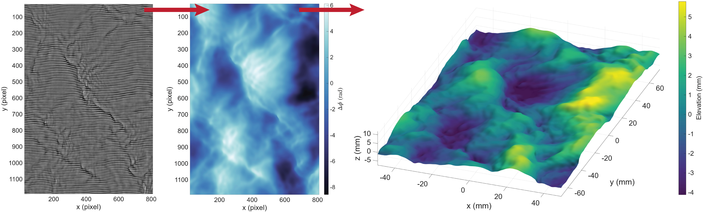

# FtpSolver

> Fourier Transform Profilometry for time-resolved reconstruction of surface elevation.

`FtpSolver` is a MATLAB class that reconstructs surface elevation fields from
sequences of fringe-pattern images using **Fourier Transform Profilometry (FTP)**.
It is aimed at time-resolved measurements — for example, the global measurement of
water waves — where a full height field must be recovered for every frame of a
recording.

<picture>
  <source media="(prefers-color-scheme: dark)" srcset="assets/Workflow_dark.jpg">
  <source media="(prefers-color-scheme: light)" srcset="assets/Workflow_light.jpg">
  
</picture>

## Features
- **Two demodulation methods:** standard Fourier-transform demodulation and
  continuous wavelet demodulation.
- **Two phase-to-height calibration models:** Takeda's model (`takeda`) and a pixel-wise polynomial fit (`poly`).
- **Two phase-correction strategies:** spatial and temporal, for handling uncertainty in the absolute phase. 
- **Multiple input formats:** standard image formats (`.png`, `.tiff`, `.bmp`, `.jpg`), plus LaVision DaVis `.set` and `.im7`.
- **Camera calibration support**: reads pinhole and polynomial calibrations for real-world scaling and de-warping.
- **Correction of height-induced lateral displacement**: a camera viewing the surface along a slanted ray samples a point that is displaced in-plane whenever the surface sits away from the reference plane. With a pinhole calibration available, setting `prcOpts.lateralShiftCorrection` back-projects every pixel to its true world position and resamples the height field onto the nominal mesh, removing that displacement regardless of camera tilt and position.
- **Automatic outlier detection**: detects abnormally high phase gradients (usually due to debris on the surface) and stores the positions per timestep in `postData.phaseAnomalies`. 
- **Analysis and output:** animation of surfaces/phase and export of results.


## Requirements

- MATLAB R2024b or newer
- Image Processing Toolbox
- Signal Processing Toolbox
- Computer Vision Toolbox
- Curve Fitting Toolbox
- Wavelet Toolbox
- Statistics and Machine Learning Toolbox

### Third-party dependencies

- [**LaVision `readimx` library**](https://www.lavision.de/en/downloads/software/matlab_add_ons.php), required only if reading directly from DaVis ``.im7`` or ``.set`` files.

## Installation

```matlab
gitclone('https://github.com/asemati/FTProfilometry')
addpath(genpath('path/to/FTProfilometry'));
```
The `readimx` library must also be added to the MATLAB path if required.

## Quick start

```matlab
demoCase = FtpSolver("demoCase", ...              % case ID must be a valid MATLAB variable name
    refAddr       = "path/to/reference.tif", ...  % flat reference fringe image
    dataAddr      = "path/to/data.tif", ...       % fringe image sequence
    camCalibAddr  = "path/to/cam/calib.mat", ...  % camera calibration path
    resizeFactor  = 1, ...                        % rescale factor, between 0 and 1
    cropRect      = [100 100 1000 600] ...       % computational domain (X, Y, Width, Height)
    );    

demoCase.setRange(1,100);             % set solve range from frame 1 to 100
demoCase.solve();                     % run the full FTP pipeline over the solve range
demoCase.animateSurf(1, 100, 10);     % preview frames 1–100 at 10 fps
demoCase.writeCase("path/to/output");
```
## Typical workflow

1. **Construct** the solver with a reference image, a data sequence, and geometry/scaling
   parameters.
2. **Define the ROI** with `setROI()` to restrict processing to the region of interest.
3. **(Optional) Calibrate** the phase-to-height model.
4. **Solve** with `solve()` to demodulate, unwrap, phase-correct, and convert to height
   for every frame.
5. **Inspect and export** using `animateSurf()`, and `writeCase()`.

## Resolution

Two factors control resolution independently. `resizeFactor` (default `0.1`) rescales the raw images
before they are demodulated and so governs the cost of the computation, while
`resizeFactorDisplay` (default `0.5`) rescales the unwrapped phase before it is stored
and so governs the size of everything that comes out of a run: the surface and phase
stacks and the coordinate meshes. A 1000×600 computational
domain therefore produces 500×300 output arrays at the default setting. Run `setResizeFactor(1)` to keep the full grid.

## Calibration

The phase-to-height conversion uses one of two models:

| Model     | Method                              | Set up via                          |
|-----------|-------------------------------------|-------------------------------------|
| `takeda`  | Analytical                          | `demoCase.setProfModelTakeda(L, d)`          |
| `poly`    | Pixel-wise polynomial fit           | `demoCase.setProfModelPoly(addr)` |

The `poly` calibration is built from a stack of reference planes at
known heights (`heightVec`) and **requires the solver to be run at full resolution**
(`resizeFactor = 1`, `resizeFactorDisplay = 1`). Run `clbModOn()` before `calibratePoly(...)` to set these parameters automatically. Calibration coefficients can be saved and reloaded with `writePolyCalibration` / `setProfModelPoly`.

## Key methods

| Method                                | Purpose                                             |
|---------------------------------------|-----------------------------------------------------|
| `setROI`                              | Interactively define the computational domain.        |
| `calibrateTakeda` / `calibratePoly`   | Calibrate the phase-to-height model.                  |
| `setRange`                            | Restrict processing to a sub-range of frames.         |
| `drawPeaks`                           | Visualize the performance of the spatial phase correction technique.
| `writeInParts`                        | Split the computation into blocks and write to temporary files on disk during the run. 
| `solve`                               | Run the full processing pipeline.                     |
| `animate`                             | Visualize the reconstructed surface / phase.          |
| `exportVideo`                         | Export a video of the surface / phase.                |
| `writeCase`                           | Save results to binary and `.mat` files.              |
|`readData`                             | Read surface elevation / phase data `.bin` files.     |


## Output format

`writeCase` writes results as binary (`*_surfData.bin` and `*_phaseData.bin`) files. Each file stores the number of dimensions, the array size, and then the data as single-precision values. Use the static helper `FtpSolver.readData(addr, seekTime)` to read them back into MATLAB. The class object itself, minus the surface and phase data, is written to a `.mat` file. Coordinate arrays are written to a separate `surfMesh.mat` file.

## Citation
This implementation is based on the FTP method described in:
> Semati, A., Shankaran, A., Smeltzer, B.K., Aesoy, E., Hearst, R.J. and Ellingsen, S.A. (2026).
> *Simultaneous free-surface profilometry and subsurface velocimetry with fringe projection and PIV.*
> Exp Fluids 67, 120 (2026)
> https://doi.org/10.1007/s00348-026-04242-x

## License
MIT

## Author
**Ali Semati**
